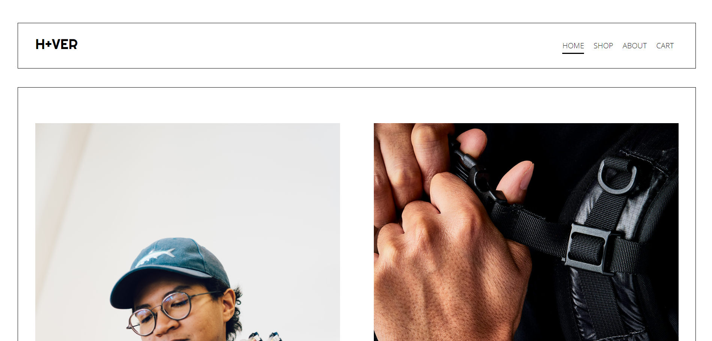

# H+ver E-Commerce

###

## GOALS

- Implement an ecommerce website with my team of four people

## TECH STACK

- React
- NodeJS and express

## RUN LOCALLY
```
git clone https://github.com/Charles9869/H-VER.git
```
```
cd server
yarn install
yarn start
```
```
cd client
yarn install
yarn start
```
## SCREENSHOTS

### Homagepage



### Shop page


### Item page


### Cart page


